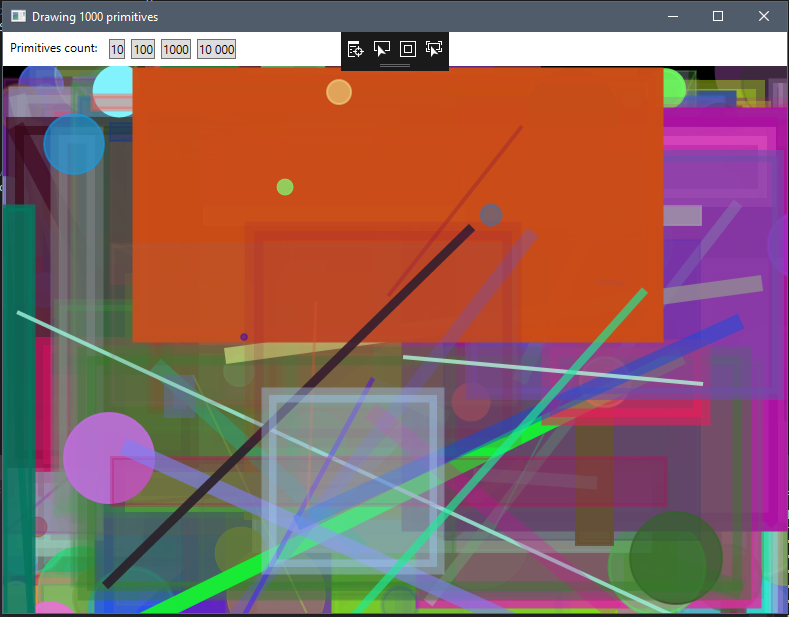

### Sample drawing application in WPF
Used canvas childrens.

There is 3 projects:

 - *SampleDrawing.Renderers* - all renderers that used on for rdnering on canvas
 - *SampleDrawing.IoC* - IoC container implementation. Used for separating view and core logic.
 - *SampleDrawingApp* - User application

#### Results

#### P.S.
To change default renderer check application initializer class (*DefaultRendererInitializer.cs*).
This file contains application "entry point". Every deps, settings and core feature is available through this layer.